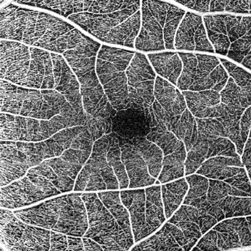

# Removal of Motion Artifacts from Optical Coherence Tomography Angiography Images




### Training
Images to be trained are put in the "data/train". We have provided few images to replicate the training process. These images were generated using the patch_generator.py on OCTA images.

```
python3 train.py
```


### Testing

The trained model can be downloaded from [here](https://drive.google.com/file/d/1w8GHWn-VSsL-EgvwTJT7AVSPLipE2LEj/view?usp=sharing). Paste the downloaded "UNet_epoch-last.pth" inside motion_arti folder. We have provided a sample image to be tested in test/tampered/0.jpg
Images generated without the motion artifacts will be written in the motion_arti folder.


```
python3 test.py
```
